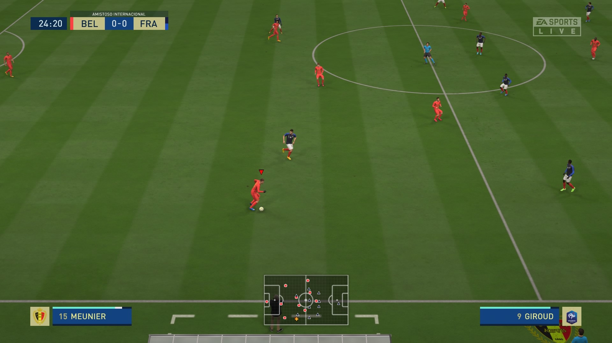
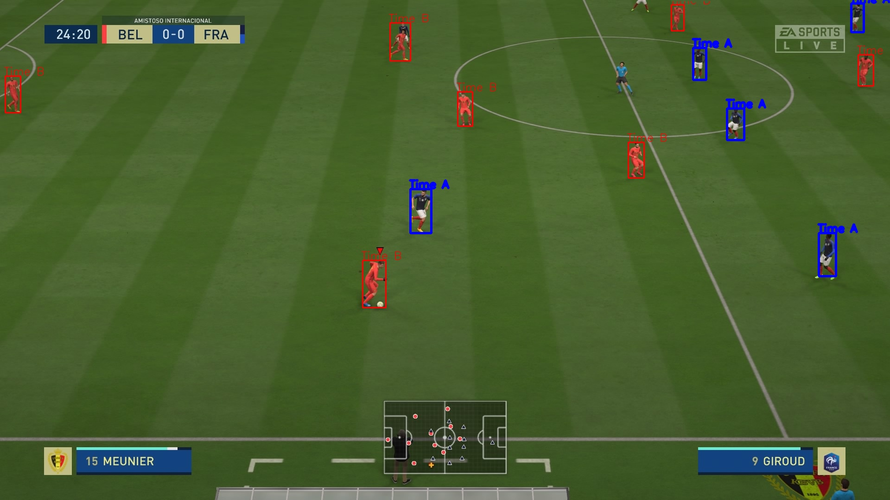
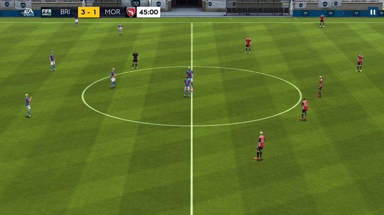
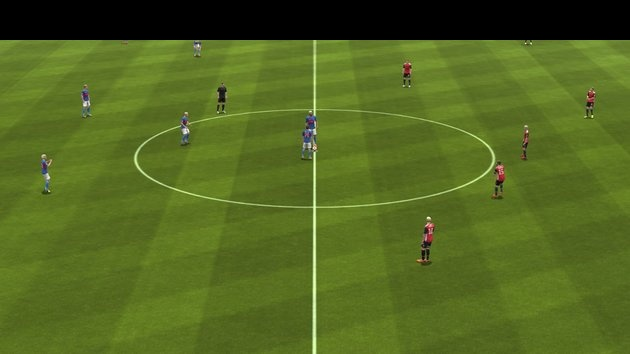

# Players-Segmentation-in-Soccer-Game-Images

  

# **Students**

João Victor Garcia Coelho - 10349540

Paulo André de Oliveira Carneiro - 10295304

In this project, we used to code together while we were in call via Google Meets. Therefore, both students worked and perfomed all the roles together.

  

# **Abstract**

This project aims to develop and algorithm to separate players from the background and the crowd and subsequently differentiate players from each team.

# **Goal**

  

Our main goal with this work is to be able to detect the players in the field. To achieve this goal, we opted to work on screenshoots of FIFA game matches, due to the ease of acquiring these images and the image quality itself. To achieve this goal we will use several image processing techniques, such as color similarity extractor, morphological operations, thresholding techniques, contour finding, and others.

## **Inputs**:

  
As mentioned above, as input our algorithm expect screenshoots from FIFA20 game matches. The screenshoot must have the perspective from above.

  

## **Outputs**:



## **Steps**:

 
**1.** The first step is to apply color similarity extraction to identify the field, so we can then differentiate players from it.
* First we define a mask based on the green color range. Then, we applied this mask on the image using a Bitwise AND Operation, so we can identify/separate what is a green pixel (field) and what is not.

**2.** The second step is to use Thresholding Techniques and Morphological Operations to denoise the image and enhance the image quality. 
* For the thresholding part, we used two techniques combined: Otsu Thresholding and Binary Thresholding.
* On the morphological part, we used a Closing followed by Opening operation.

**3.** The third and last step is to use the Countour Finding Method to detect objects in the image. For each contour found, we apply a new mask based on the color of the team's jerseys, so then we can identify the team of each player.

# **First Results**

The First Results Code can be encountered in [Field Line Detection](/Field%20Line%20Detection.ipynb).
 
 This was our first approach to remove the non-field elements, but later on we found another method that does the same thing but more precisely.
 
 On this notebook, we used an edge detecting approach along with a hough transform to separate the field from other elements such as the crowd.
  

## **Original Image**




## **Line Detected Image**



As we can see in the image above, we were able to remove the non-field elements.

## **Final Results**

After applying the method described earlier, we were able to detect most of the players in the images tested. But there are some considerations and failures on our attempts.

* 	The algorithm depends mainly on the color range of the shirts to execute properly. So, choosing a range for their color is essential to detecting the players.
* We had a lot of difficulty in finding a good range for the tested images because it is very difficult to choose a range for colors in HSV, specifically in the HSV model of OpenCV which has a different range than the normal HSV.
* In addition, the size of the image also interferes with the result, because as we count the pixels that matched that given color, larger images (with more pixels) can give different results than smaller images.


This Results can be found in the following notebook:

[Players Detection](/notebooks/Players%20Detection.ipynb)

## **Running Demo**

```bash
pip install -r requirements.txt
python3 scripts/main.py --filename='path to your image or video' --type='image or video'
```